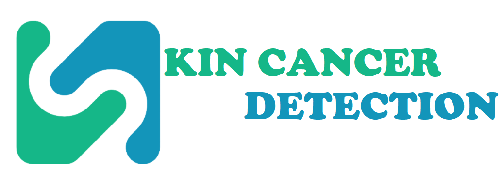

# SKIN CANCER DETECTION
# Monash University Data Analytics Bootcamp Project 4

## Overview

Welcome to the exciting culmination of our journey in the Monash University Data Analytics Bootcamp! In Project 4, Group 2 — comprising Nicholas, Sohaila, Abdi, and Duc — proudly presents an innovative venture at the intersection of data analytics and healthcare.

## Project Objective

Our mission is clear: empower end-users with a tool that seamlessly integrates machine learning to enhance skin health awareness. In collaboration with Monash University, we've developed a sophisticated solution aimed at detecting potential skin cancer through the analysis of skin spots captured in photographs.

## How It Works

Users can simply upload a photo to our dedicated website, where a state-of-the-art machine learning model awaits. This model, meticulously trained and refined, assesses the given skin spot and provides insights into whether it exhibits characteristics associated with skin cancer or not.

## Meet the Team

Let's get acquainted with the brilliant minds behind this project:

- **Nicholas**: *Bringing expertise in Model training & Image preprocessing*
- **Sohaila**: *Contributing with proficiency in Colecting data & Model training*
- **Abdi**: *Offering insights and skills in Image preprocessing & Frontend application*
- **Duc**: *Providing valuable contributions through API & Front-end application*

## Join Us on this Journey

As we delve into the realms of data analytics, machine learning, and healthcare, we invite you to explore our project, engage with the platform, and witness the potential impact it can have on skin health awareness.

Thank you for being part of this exciting venture!

### References

Collection of data - https://www.kaggle.com/search?q=skin+cancer+in%3Adatasets
Emoji - https://emojidb.org/
Animation - https://community.home-assistant.io/t/mushroom-cards-build-a-beautiful-dashboard-easily/388590/3272

# DRAFT
# skin-cancer-detection
Monash University Data Analytics Bootcamp Project 4 by Group 2 (Nicholas, Sohaila, Abdi, Duc)

Project objective:
To allow enduser to provide a photo to a website containing an ML model that detects whether the skinspot shows **malignant or benign** melanoma.

Collection of data - https://www.kaggle.com/search?q=skin+cancer+in%3Adatasets
40k total - 50% malignant, 50% benign - Sohalia and Abhi by Sunday

Image preprocessing - Abhi and Nicholas by 8th

Model training - Nicholas and co. by 11th

Flask application + input + output - Duc by 18th
